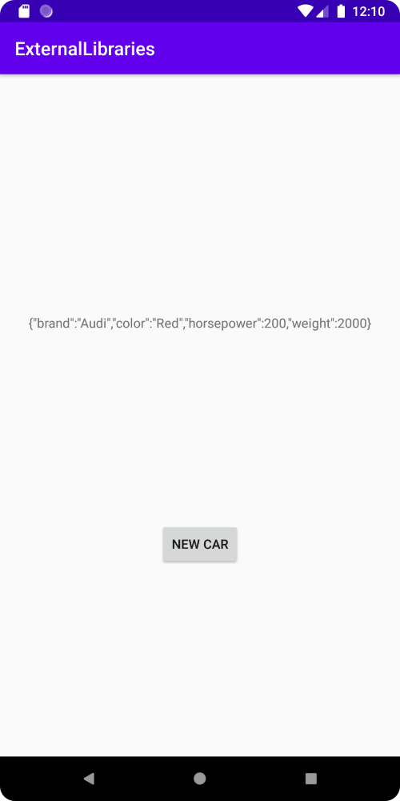

# Rapport

Först lades en dependency till inuti gradle filen.

Koden ser ut som följande:

````
dependencies {
    implementation 'com.google.code.gson:gson:2.10.1'
}
````

Sedan lades en ny klass till "Car". En bil kan ha 4 olika attribut, som visas nedanför.

Koden ser ut som följande:

````
public class Car {
    private int weight;
    private int horsepower;

    private String color;
    private String brand;

    public Car(int weight, int horsepower, String color, String brand) {
        this.weight = weight;
        this.horsepower = horsepower;
        this.color = color;
        this.brand = brand;
    }
}
````

Sedan lades en TextView och en Button till inuti "activity_main.xml".

Koden ser ut som följande:

````
<TextView
    android:id="@+id/show"
    android:layout_width="wrap_content"
    android:layout_height="wrap_content"
    android:layout_marginBottom="200dp"
    android:text="Press the button"
    app:layout_constraintBottom_toBottomOf="parent"
    app:layout_constraintEnd_toEndOf="parent"
    app:layout_constraintStart_toStartOf="parent"
    app:layout_constraintTop_toTopOf="parent" />

<Button
    android:id="@+id/newCarButton"
    android:layout_width="wrap_content"
    android:layout_height="wrap_content"
    android:text="New Car"
    app:layout_constraintBottom_toBottomOf="parent"
    app:layout_constraintEnd_toEndOf="parent"
    app:layout_constraintStart_toStartOf="parent"
    app:layout_constraintTop_toBottomOf="@+id/show" />
````

Sedan lades funktionalitet till för knappen och TextViewen. När knappen klickas på konverteras
1 av 4 olika bilar till en JSON sträng som sedan visas i TextViewen.
Detta görs genom att använda en ArrayList med 4 olika bilar, och genom att använda GSON för att konvertera bilarna till JSON strängar.

Koden ser ut som följande:

````
public class MainActivity extends AppCompatActivity {

    private TextView show;

    private ArrayList cars;

    private int count = 0;

    private Gson gson = new Gson();

    @Override
    protected void onCreate(Bundle savedInstanceState) {
        super.onCreate(savedInstanceState);
        setContentView(R.layout.activity_main);

        cars = new ArrayList<Car>();
        cars.add(new Car(2000, 200, "Red", "Audi"));
        cars.add(new Car(2100, 210, "Blue", "Volvo"));
        cars.add(new Car(2200, 220, "Yellow", "BMW"));
        cars.add(new Car(2300, 230, "Green", "Toyota"));
        show = findViewById(R.id.show);
        Button newCarButton = findViewById(R.id.newCarButton);
        newCarButton.setOnClickListener(new View.OnClickListener() {
            @Override
            public void onClick(View view) {
                String json = gson.toJson(cars.get(count));
                show.setText(json);
                count++;

                if (count == 4){
                    count = 0;
                }
            }
        });
    }
}
````

Appen ser ut som följande:



